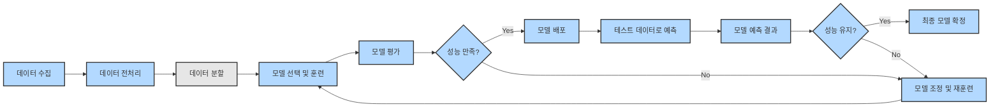
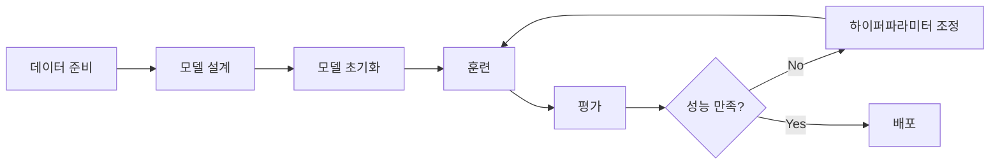

# 02.18_머신러닝

Tensor : AI계에서 데이터의 단위. ‘

Tensorflow : 여기저기 흘러다니면서 데이터를 처리한다’는 뜻. 

→ high level API 

Keras → low level API

<aside>
💡

TensorFlow는 딥러닝의 핵심 연산을 수행하는 엔진이고, Keras는 텐서플로를 쉽게 사용할 수 있도록 돕는 간편한 인터페이스 입니다.

TensorFlow만 사용하면 수식, 미분, 최적화 등을 직접 구현해야 하지만, Keras를 사용하면 몇 줄의 코드로 딥러닝 모델을 만들 수 있습니다.

</aside>

Tensorflow << **PyTorch** (대세) - 설계 (stream line)이 직관적이라 선호. 

- 텐서플로와 케라스 사용 예시

```python
import tensorflow as tf
from tensorflow.keras import layers, models
import numpy as np

# 가상 데이터셋 생성
np.random.seed(0)  # 재현성을 위해 난수 시드 설정
tf.random.set_seed(0)  # 모델 학습 과정에서의 난수 발생도 일정하게 고정
train_data = np.random.rand(1000, 10)  # 1000개의 샘플, 각 샘플은 10개의 특성을 가짐
train_labels = np.random.randint(2, size=(1000, 1))  # 1000개의 이진 레이블

test_data = np.random.rand(100, 10)  # 100개의 테스트 샘플
test_labels = np.random.randint(2, size=(100, 1))  # 100개의 테스트 이진 레이블

# 모델 정의
model = models.Sequential([
    layers.Dense(16, activation='relu', input_shape=(10,)),  # 은닉층: 16개의 뉴런을 갖는 Dense 층, ReLU 활성화 함수 사용
    layers.Dense(1, activation='sigmoid')  # 출력층: 1개의 뉴런, 시그모이드 활성화 함수 사용
])

# 모델 컴파일
model.compile(optimizer='adam',  # 옵티마이저: Adam
              loss='binary_crossentropy',  # 손실 함수: binary_crossentropy
              metrics=['accuracy'])  # 평가 지표: 정확도

# 모델 훈련
model.fit(train_data, train_labels, epochs=10, batch_size=32)

# 모델 평가
test_loss, test_acc = model.evaluate(test_data, test_labels)
print(f"Test accuracy: {test_acc}")

# 예측하기
test_data_fixed = np.asarray(test_data, dtype=np.float32)  # 입력 데이터를 float32로 변환
predictions = model.predict(test_data_fixed)
print(f"Prediction for the first test sample: {predictions[0]}")
```

### PyTorch

텐서(Tensor)라는 데이터 구조를 사용. 동적 계산 그래프를 통해 직관적인 코딩을 지원함. 

Autograd 모듈을 통해 연산 그래프를 자동으로 구성하고, 이를 기반으로 역전파를 수행하여 기울기를 손쉽게 계산할 수 있음. 

```python
import torch
import torch.nn as nn
import torch.optim as optim
import numpy as np
from torch.utils.data import DataLoader, TensorDataset

# 가상 데이터셋 생성
np.random.seed(0)  # 재현성을 위해 난수 시드 설정
train_data = np.random.rand(1000, 10).astype(np.float32)  # 1000개의 샘플, 각 샘플은 10개의 특성을 가짐
train_labels = np.random.randint(2, size=(1000, 1)).astype(np.float32)  # 1000개의 이진 레이블

test_data = np.random.rand(100, 10).astype(np.float32)  # 100개의 테스트 샘플
test_labels = np.random.randint(2, size=(100, 1)).astype(np.float32)  # 100개의 테스트 이진 레이블

# 텐서 데이터셋 및 데이터 로더 생성
train_dataset = TensorDataset(torch.tensor(train_data), torch.tensor(train_labels))
test_dataset = TensorDataset(torch.tensor(test_data), torch.tensor(test_labels))

train_loader = DataLoader(train_dataset, batch_size=32, shuffle=True)
test_loader = DataLoader(test_dataset, batch_size=32, shuffle=False)

# 모델 정의
class SimpleNN(nn.Module):
    def __init__(self):
        super(SimpleNN, self).__init__()
        self.fc1 = nn.Linear(10, 16)  # 은닉층: 16개의 뉴런
        self.fc2 = nn.Linear(16, 1)  # 출력층: 1개의 뉴런

    def forward(self, x):
        x = torch.relu(self.fc1(x))  # ReLU 활성화 함수
        x = torch.sigmoid(self.fc2(x))  # 시그모이드 활성화 함수
        return x

model = SimpleNN()

# 손실 함수 및 옵티마이저 정의
criterion = nn.BCEWithLogitsLoss()
optimizer = optim.Adam(model.parameters(), lr=0.001)  # Adam 옵티마이저

# 모델 훈련
for epoch in range(10):  # 10 epochs
    model.train()
    for batch_data, batch_labels in train_loader:
        optimizer.zero_grad()
        outputs = model(batch_data).squeeze()
        loss = criterion(outputs, batch_labels.squeeze())
        loss.backward()
        optimizer.step()
    print(f"Epoch {epoch+1}, Loss: {loss.item()}")

# 모델 평가
model.eval()
correct = 0
total = 0
with torch.no_grad():
    for batch_data, batch_labels in test_loader:
        outputs = model(batch_data).squeeze()
        predicted = (outputs > 0.5).float()
        total += batch_labels.size(0)
        correct += (predicted == batch_labels.squeeze()).sum().item()

test_acc = correct / total
print(f"Test accuracy: {test_acc}")

# 예측하기
model.eval()
with torch.no_grad():
    sample_output = model(torch.tensor(test_data[0])).item()
    print(f"Prediction for the first test sample: {sample_output}")
```

Tensorflow vs. PyTorch

| **항목** | **TensorFlow** | **PyTorch** |
| --- | --- | --- |
| 코딩 스타일 | 선언적 (정적 그래프) | 명령형 (동적 그래프) |
| 디버깅 | 복잡 | 직관적 |
| 유연성 | 낮음 | 높음 |
| 학습 곡선 | 가파름 | 완만함 |
| 커뮤니티 | 광범위함 | 급성장 중 |
| 배포 | 강력한 지원 (TensorFlow Serving, TensorFlow Lite 등) | 상대적으로 미흡 |

### Kaggle

전 세계 데이터 연구자들이 데이터를 분석할 수 있도록 대회를 개최하고, 분석 내용을 토론할 수 있는 커뮤니티를 제공하는 플랫폼

- API로 데이터 가져올 수 있음.

### 수학적 함수

<aside>
💡

선형 그래프? 비선형 그래프?

- 직선 그래프는 선형, 곡선 그래프는 비선형을 의미합니다.
</aside>

- 사용 이유 : 데이터의 복잡한 비선형 관계를 효과적으로 학습하고 표현할 수 있기 때문에.
    - 오버피팅, 언더피팅 방지: 딥러닝 모델에서 적절한 차수를 선택하는 것은 오버피팅 또는 언더피팅을 방지하는 데 중요합니다. 너무 낮은 차수의 함수는 `과소적합(underfitting)`을 유발할 수 있고, 너무 높은 차수의 함수는 `과적합(overfitting)`될 가능성이 있습니다.
    적절한 차수를 선택하면 모델의 일반화 성능이 향상됩니다.

- **경사하강법과 최적화**

딥러닝 모델의 학습 과정에서 경사하강법은 중요한 역할을 합니다.

경사하강법은 손실 함수를 최소화하기 위해 파라미터를 조정하는 알고리즘입니다.

이때, **손실 함수는 비선형 함수로 표현될 수 있으며, N차 함수**의 특성을 가질 수 있습니다.

모델이 비선형 관계를 잘 학습할 수 있도록 **경사하강법은 이러한 손실 함수의 최소점을 찾아갑니다.**

### 벡터

- 사용 이유: 데이터를 수치적으로 표현하여 연산과 분석을 쉽게 수행할 수 있게 하기 때문에
- 알아두면 좋을 정보
    - 1차원 배열 (벡터) - 머신러닝에서 특징 벡터, 텍스트 분석에서 단어 임베팅, 이미지 처리에서 픽셀 값 등의 형태로 사용됨
    - 2차원 배열 (행렬) - 이미지 데이터나 선형 방정식의 계수 행렬
    - 다차원 배열 (텐서) - 주로 딥러닝에서 이미지, 비디오, 음성 데이터를 처리할 때 사용

## 데이터 전처리 ⭐️

<aside>
💡

인공지능 이론 및 모델 학습 공부는 **개발 분야가 아닌 연구 분야**입니다.

연구 중에서도 **연역법** 혹은 **귀납법** 연구 방법이라는 포인트로 접근해야 인공지능 이론을 제대로 이해할 수 있습니다.

그렇기 때문에, 앞으로 인공지능 모델 학습 공부를 하면서 아래 두 가지 내용을 생각하면서 공부를 하시면 좀 더 쉽게 인공지능 개념을 이해할 수 있을 것입니다.

1. **내가 아는 해결 방법이 최적의 답이 아닐 수도 있다. 또한 결과가 좋지 않을 수 있다.**
    - 인공지능 모델은 데이터와 알고리즘에 따라 다양한 방식으로 개선될 수 있습니다
2. **예측이 100% 정확하지 않으며, 실험과 데이터 검증이 중요하다.**
    - 같은 문제라도 데이터나 환경에 따라 결과가 달라질 수 있으므로, 지속적인 테스트와 검증이 필요합니다.
</aside>

데이터 전처리 = 자료를 다루기 쉬운 형태로 변환시키는 과정

| **작업** | **설명** | **해야하는 이유** |
| --- | --- | --- |
| 결측값 처리
(Missing Value) | 누락된 데이터를 식별하고 적절한 값으로 대체 | **1. 데이터 수집 과정의 오류**
2. 응답자의 누락
3. 데이터 통합 문제 → 유저가 준 데이터를 다른 데이터와 합치는 과정(join)에서 한 쪽이 비게 되는 현상. 
4. 시간적 이유 (특정시간대 누락) |
| **이상치 제거** | 데이터 내 비정상적인 값들을 식별하고 제거 | 1. 데이터 입력 오류 (’어쩌다’ 잘못 넣은 게 아니라 ‘대량’ 잘못 넣은 경우)
2. 계측기기 오류
3. 특정 이벤트나 상황 |
| **데이터 정규화** | 데이터를 **일정한 범위(예: 0과 1 사이)로 변환**하여 모델 학습을 돕는 과정 | 1. 데이터 일관성 (데이터 비교를 위해)
2. **알고리즘 성능** |
| 데이터 **변환** | 데이터를 **로그 변환,** **원-핫 인코딩** 등으로 변환 | 1. 정규 분포화
2. 분산 축소
3. 비선형 관계 |

- 원-핫 인코딩
    - 범주형 데이터를 이진 벡터(이진법으로만 이루어진 벡터)로 변환하는 기법
    - 컴퓨터는 내부적으로 수를 이진법으로 다루기 때문에
    - **원 (One)**: 각 범주형 데이터가 벡터에서 하나의 요소만 1(Hot)로 표시된다는 의미입니다.
    - **핫 (Hot)**: 1로 표시된 요소를 의미합니다. 즉, "핫"은 켜져 있다는 뜻으로, 활성화된 상태를 나타냅니다.
        - 사과 → [1, 0, 0]
        - 바나나 → [0, 1, 0]
        - 딸기 → [0, 0, 1]
        
        *순서가 의미있을 수 있음 (예를 들어 잘함-보통-못함 이런 경우)
        
    - 인코딩: 원본(소스)가 들어갔을 때, 변형된 결과 나오게
    - 디코딩 : 변형된 결과를 원본으로 바꾸는 역함수(인버스)

<aside>
❓ 이미지는 전처리할 때 어떤 과정을 겪나요?

→ 무조건은 아니지만, 일반적으로 이미지 데이터를 벡터로 변환합니다.

그 이유로는 아래 두 가지와 같습니다.

| 이유  | 설명 |
| --- | --- |
| **머신 러닝 모델에 입력하기 위해** | 대부분의 머신 러닝 알고리즘은 벡터 형태의 입력을 필요로 합니다.
이미지 데이터를 벡터로 변환하면 **모델이 이미지를 이해하고 처리할 수 있게 됩니다** |
| **특징 추출을 위해** | **이미지의 주요 특징을 벡터 형태로 표현**하면, 모델이 이미지의 중요한 정보를 학습할 수 있습니다. |
</aside>

- 사용 이유: 더 좋은 모델을 만들기 위해 전처리를 한다.
1. 결측값 처리 : Missing Value를 식별하고 이를 적절한 방법으로 대체하거나 제거
2. 이상치 제거: 데이터 분석의 정확도를 왜곡시킬 수 있으므로, 이를 식별하고 제거
3. 스케일링: 다양한 수치 데이터가 있을 때 이를 비교, 분석하기 쉽도록 동일한 범위 또는 척도로 변환

| **데이터
전처리** | 1. 데이터 수집
2. 결측값 처리
3. 이상치 제거
4. 데이터 정규화
5. 데이터 변환
6. 데이터 분할 |
| --- | --- |

- 데이터 정규화
    
    ```python
    from sklearn.preprocessing import MinMaxScaler
    
    # 데이터 정규화 (0과 1 사이 값으로 스케일링)
    scaler = MinMaxScaler() # MinMaxScaler()는 주어진 데이터의 최소값과 최대값을 기반으로 각 값을 0과 1 사이로 변환하는 역할
    df[['연봉', '근속연수']] = scaler.fit_transform(df[['연봉', '근속연수']])
    print("\n데이터 정규화 후 데이터셋:")
    print(df)
    ```
    
    - `MinMaxScaler()`: 주어진 데이터의 최소값과 최대값을 기반으로 각 값을 0과 1 사이로 변환하는 클래스입니다.
    - `scaler.fit_transform(df[['연봉', '근속연수']])`: 데이터프레임에서 `연봉`과 `근속연수` 열을 선택하여 정규화합니다.

- 데이터 변환
    
    ```python
    import pandas as pd
    
    # 예제: 원-핫 인코딩 (직원 이름을 카테고리 변수로 변환)
    df = pd.get_dummies(df, columns=['직원'])
    print("\n데이터 변환 후 데이터셋:")
    print(df)
    ```
    
    - `pd.get_dummies(df, columns=['직원'])`: '직원' 열을 원-핫 인코딩하여 각 직원 이름을 새로운 이진 열로 변환합니다.
    - `columns=['직원']`: 원-핫 인코딩할 열을 지정합니다. 여기서는 '직원' 열을 지정합니다.
    - 반환된 데이터프레임에는 '직원' 열이 제거되고, 각 직원 이름에 해당하는 새로운 열이 추가됩니다. 각 열의 값은 해당 직원일 경우 1, 아니면 0으로 표시됩니다.

- 데이터 분할
    
    학습용과 검증용으로 나눈다. 
    
    ```python
    from sklearn.model_selection import train_test_split
    
    # 데이터 분할 (학습용 80%, 검증용 20%)
    train, test = train_test_split(df, test_size=0.2, random_state=42)
    print("\n학습용 데이터셋:")
    print(train)
    print("\n검증용 데이터셋:")
    print(test)
    ```
    
    - `train_test_split(df, test_size=0.2, random_state=42)`: 데이터프레임 `df`를 학습용 데이터셋과 검증용 데이터셋으로 분할합니다.
    - `test_size=0.2`: 데이터의 20%를 검증용 데이터셋으로 할당하고, 나머지 80%를 학습용 데이터셋으로 할당합니다.
    - `random_state=42`: 난수 발생기의 시드를 설정하여, 분할을 재현 가능하게 합니다. 동일한 `random_state`를 사용하면 언제나 같은 결과를 얻을 수 있습니다.

## 데이터 증강 (Data Augmentation)

*(현업에선 트레이닝을 위한 데이터 자체가 많이 부족하다...)*

- 머신러닝을 위해 기존 데이터를 변형하여 새로운 데이터를 생성하는 기법 (=~합성 데이터)
    - **기존 데이터를 소스로 삼아 새로운 데이터를 만들어내는 것.**
- 단순 복사하는 것이 아니라, 회전, 크기 조절, 색상 변화, 노이즈 추가 등의 방법을 사용하여 다양한 형태의 데이터를 만드는 것.

| 기법 | 설명 |
| --- | --- |
| **이미지 회전 (Rotation)** | 이미지를 특정 각도로 회전 |
| **이미지 크기 조절 (Rescaling)** | 확대 또는 축소하여 크기 변형 |
| **이미지 뒤집기 (Flipping)** | 좌우 또는 상하 반전 |
| **색상 변형 (Color Jittering)** | 밝기, 대비, 채도를 조절 |
| **노이즈 추가 (Adding Noise)** | 랜덤한 픽셀 변화를 추가하여 모델이 노이즈에 강해지도록 학습 |
| **역번역 (Back-Translation) [NLP]** | 문장을 다른 언어로 번역한 후 다시 원래 언어로 번역 |
| **속도 변화 (Speed Perturbation) [음성]** | 오디오 파일의 속도를 변경 |
- 사용이유 : 모델 학습에 필요한 데이터의 다양성과 양을 증가시켜 과적합을 방지하고, 일반화 성능을 향상시키기 위해서
    - 데이터 다양성 증가
    - 일반화 성능 향상
    - 데이터 부족 문제 해결
    - 모델의 견고성 향상
- 한계
    - 잘못된 변형이 적용되면 모델이 실제 데이터의 특성을 정확히 반영하지 못하고, 학습을 왜곡시킬 수 있다.
    - 모델이 증강 데이터에 너무 의존할 경우, 특정한 변형된 데이터에 대해서는 강하지만, 완전히 새로운 데이터에는 취약할 수 있다.
    - 데이터 증강이 효과적인 분야(이미지, 음성 등- 아날로그, 자연 데이터)도 있지만, 일부 도메인에서는 증강된 데이터가 실제 문제 해결에 크게 기여하지 못할 수 있다. (금융, 정형데이터의 경우)

- 증강 데이터가 잘 된 건지, 잘못된 건지 어떻게 검증하냐?
    
    → 검증 데이터 (0.2 정도) 남겨둔 걸로, 예측해보면서 성능 확인
    
    - *내 모델 어떻게 하면 성능을 더 좋게 할까..? 데이터와 모델을 변형하면서 계속 시도..*
    - *데이터 변형도 다르게 시도하면서 성능 올려야..*

| **데이터
증강** | 1. 이미지 회전
2. 이미지 뒤집기
3. 이미지 이동
4. 이미지 확대/축소
5. 색상 변형
6. 노이즈 추가 |
| --- | --- |

### ~사용방법 ~

## 데이터셋 분할(Dataset Split)

주어진 데이터를 목적에 맞게 학습(training), 테스트(test), (필요 시)검증(validation)으로 분할하여 모델의 성능을 평가하고 일반화하기 위한 과정


| **구분** | **설명** |
| --- | --- |
| **학습(training) 데이터 (필수)** | 모델이 **패턴을 학습하는 데 사용되는 데이터**입니다.
모델이 **입력 데이터와 출력 간의 관계를 학습**하는 과정에서 사용됩니다. |
| **테스트(test) 데이터 (필수)** | 학습이 완료된 **모델의 최종 성능을 평가하는 데이터**입니다.
**모델이 한 번도 본 적 없는 데이터로 평가해야 합니다.** |
| **검증(validation) 데이터**
*(선택 사항)* | **하이퍼파라미터 튜닝** 및 **모델 최적화 과정**에서 사용되는 데이터입니다.
학습 중 **성능 평가를 위한 임시 데이터셋**이며, **과적합을 방지하는 역할**을 합니다. |

<aside>
💡

검증 데이터(validation set)는 선택 사항이며, 교차 검증(Cross-Validation) 등의 방법을 사용할 경우 별도로 분할하지 않을 수도 있습니다.

</aside>

‘답’이 있는 문제를 training해왔던 교육과정. 

실제 세상살이는 ‘답’이 없음. 자신만의 답을 찾아가는 과정. 조정하며. 

test data를 잘 맞추는 모델을 만들려면, 학습 데이터를 어떻게 트레이닝해야할까? 

데이터셋 분할(train dataset-test dataset): 모델을 학습할 때 과적합을 방지하고, 모델의 성능을 객관적으로 평가하며, 실제 데이터를 처리할 때 모델이 잘 일반화되는지 확인하기 위해서 

- **검증 데이터셋을 이용해 모델의 하이퍼파라미터를 최적화할 수 있음.**

1. 직접 분할 기법
    
    ```python
    # 전체 데이터셋에서 학습 데이터 비율 설정
    train_size = int(0.6 * len(df))  # 학습 데이터 비율 (60%)
    
    # 학습 데이터 분할
    train_data = df[:train_size]  # 학습 데이터로 분할
    
    # 학습 데이터셋 크기 확인
    print("학습 데이터셋 크기:", len(train_data))
    # train_data 형태 확인하기
    print("train_data:", train_data) # 0 ~ 59
    ```
    
    → 데이터를 순차적으로 분할하기 때문에, 문제가 생길 수 있다. 
    
2. 랜덤 분할 기법 
    
    
    
    ```python
    from sklearn.model_selection import train_test_split
    
    train_data, test_data = **train_test_split**(data, test_size=0.2, **random_state=42**)
    ```
    
    ```python
    # 난수 생성 (랜덤 시드 없음)
    random_numbers1 = np.random.rand(5) -> # first call: [0.51718097 0.31576424 0.03235194 0.44730853 0.58715261]
    random_numbers2 = np.random.rand(5) -> # second call : [0.23335989 0.09808566 0.41867871 0.69419256 0.89127382]
    
    # 난수 생성 (랜덤 시드 있음)
    np.random.seed(42)
    random_numbers1 = np.random.rand(5) -> # first call: [0.37454012 0.95071431 0.73199394 0.59865848 0.15601864]
    
    np.random.seed(42)
    random_numbers2 = np.random.rand(5) -> # second call: [0.37454012 0.95071431 0.73199394 0.59865848 0.15601864]
    
    ```
    
    ~ 트레이닝, 검증, 테스트 데이터 분할 방식
    
    k-fold 교차 검증 ~
    

## 머신러닝


경험을 통해 자동으로 개선하는 컴퓨터 알고리즘의 연구 분야

컴퓨터가 스스로 하는 학습

→ 컴퓨터가 명시적인 프로그래밍 없이도 데이터를 통해 학습하고 예측을 개선하는 자동화 기술을 개발하는 것

그 전까진, 명시적으로 프로그래밍을 함. 일의 순서를 사람이 일일이 알려줬다. 

노코드, 로우코드 : 최소한의 코딩으로 소프트웨어를 개발하는 방식. 

***프로그래밍 없애려고 하는 분야 = AI → 컴퓨터에게 일을 시키려고 함. (인간이 프로그래밍하는게 아니라)***

이미지 인식, 음성 인식, 추천 시스템, 자연어 처리 등 ML의 대표적인 응용 사례 → 딥러닝에 자리 내어줌



| 단계 | 이름 | 설명 |
| --- | --- | --- |
| 1 | 데이터 수집 | 머신러닝 모델을 훈련시키기 위한 데이터를 수집하는 단계입니다. |
| 2 | 데이터 전처리 | 수집된 데이터를 정제하고, 누락된 값을 처리하며, 필요에 따라 변환하는 단계입니다. |
| 3 | 데이터 분할 (선택적) | 데이터를 훈련 데이터와 테스트 데이터로 나누는 단계입니다. |
| 4 | 모델 선택 및 훈련 | 적절한 머신러닝 모델을 선택하고 훈련시키는 단계입니다. |
| 5 | 모델 평가 | 훈련된 모델의 성능을 평가하는 단계입니다. |
| 6 | 성능 만족? | 모델의 성능이 만족스러운지 여부를 판단하는 결정 단계입니다. |
| 7 | 모델 배포 | 만족스러운 성능의 모델을 실제 환경에 배포하는 단계입니다. |
| 8 | 모델 조정 및 재훈련 | 모델의 성능이 만족스럽지 않은 경우, 모델을 조정하고 재훈련하는 단계입니다. |
| 9 | 테스트 데이터로 예측 | 배포된 모델을 사용하여 테스트 데이터로 예측을 수행하는 단계입니다. |
| 10 | 모델 예측 결과 | 모델의 예측 결과를 확인하는 단계입니다. |
| 11 | 성능 유지? | 모델이 예측 과정에서도 성능을 유지하는지 여부를 판단하는 결정 단계입니다. |
| 12 | 최종 모델 확정 | 성능이 유지되는 모델을 최종 확정하는 단계입니다. |

데이터를 넣고, 힌트나 규칙을 주지 않고 문제를 풀게(맞히게) 하는 것. 

데이터의 ‘질’이 아니라, ‘양’으로 승부보는 것.. → 데이터 때려넣기 (ㅎㅎ)

<aside>
💡

기존의 인공지능은 규칙 기반 시스템(Rule-Based System)으로, 사람이 모든 규칙을 직접 프로그래밍해야 했기 때문에 복잡한 문제를 해결하는 데 한계가 있었습니다.

머신러닝(Machine Learning)은 이러한 한계를 극복하기 위해 등장했으며, 데이터를 통해 패턴을 학습하고 스스로 예측을 개선하는 방식으로 발전했습니다.

(의료, 헬스케어 분야 난리남. 의사가 의상-관찰-진료 바탕으로 얘기하는 것 대신, 글로벌 의사들이 생산한 데이터 바탕으로 학습하면 머신러닝 의사가 더 낫다는 것. 애플 → 애플 와치 for 헬스케어)

또한, GPU와 병렬 연산 기술의 향상으로 대량의 데이터를 빠르게 처리할 수 있게 되면서, 신경망(Neural Network) 기반의 딥러닝(Deep Learning)이 실용화되었습니다.

머신러닝은 이미지 인식, 음성 인식, 자연어 처리, 금융 예측 등 다양한 분야에서 활용되며, 데이터가 많아질수록 성능이 향상되는 특징을 가집니다. 

현재 머신러닝은 단순한 예측을 넘어 자율 주행, 의료 AI, 추천 시스템 등 실생활과 산업 전반에서 필수적인 기술로 자리 잡았다. 

</aside>

⇒ 그 전에보다 지금 와서 각광받는 이유는 ‘데이터가 많아져서’

- 사용방법: 데이터 수집 및 전처리, 모델 선택 및 학습, 평가 및 검증, 그리고 예측 및 최적화의 과정을 거쳐 사용

| **순서** | **방법** | **내용** |
| --- | --- | --- |
| 1 | 데이터 수집 및 전처리 | Machine Learning 모델을 학습시키기 위해서는 대량의 데이터가 필요합니다.
데이터 수집 단계에서는 **다양한 소스에서 데이터를 모으고, 이를 분석에 적합한 형태로 정제**하는 작업이 이루어집니다.
전처리 과정에서는 **데이터의 불균형을 조정하고, 누락된 값을 처리하며, 필요에 따라 데이터 변환 작업**을 수행합니다. |
| 2 | 모델 선택 및 학습 | 데이터가 준비되면, 문제에 적합한 Machine Learning 알고리즘을 선택합니다.
**알고리즘 선택은 문제의 특성, 데이터의 구조, 요구되는 예측 정확도 등을 고려**하여 이루어집니다.
선택된 알고리즘을 사용하여 **데이터를 학습시키는 과정에서는 학습 데이터를 통해 모델의 파라미터를 최적화**합니다. |
| 3 | 평가 및 검증 | 학습된 모델의 성능을 평가하기 위해 **별도의 검증 데이터**를 사용합니다.
이 단계에서는 **모델의 예측 정확도, 정밀도, 재현율 등의 지표를 확인**하며, **필요에 따라 모델을 개선**합니다.
또한, 교차 검증(cross-validation)을 통해 모델의 일반화 성능을 평가하여 과적합(overfitting)을 방지합니다. |
| 4 | 예측 및 최적화 | 최종 모델이 준비되면, 이를 **실제 데이터에 적용하여 예측을 수행**합니다.
예측 결과는 **비즈니스 의사 결정에 활용**되며, 예를 들어 **고객 행동 예측, 수요 예측, 금융 시장 분석** 등에 사용됩니다.
지속적인 모니터링과 피드백을 통해 모델을 최적화합니다. |

<aside>
❓

과적합이란?

- 과적합은 모델이 훈련 데이터에 너무 잘 맞춰져서 새로운 데이터(검증 데이터 또는 테스트 데이터)에 대해 일반화 성능이 떨어지는 현상을 말합니다.
</aside>

단순한 숫자 예측 모델 만들기

```python
import numpy as np
from sklearn.linear_model import LinearRegression

# 데이터 수집
X = np.array([[1], [2], [3], [4], [5], [6], [7], [8], [9], [10]])
y = np.array([2, 4, 6, 8, 10, 12, 14, 16, 18, 20]) 

# print(X)
# print(y)
# 모델 선택 및 학습
model = LinearRegression()
model.fit(X, y) # fit은 모델을 데이터에 맞추는(훈련하는) 함수

# 예측 및 평가
X_test = np.array([[11], [12], [13], [14], [15]])
# model.predict(X_test)는 학습된 선형 회귀 모델을 사용하여 새로운 데이터 X_test에 대한 예측값을 계산하는 함수
y_pred = model.predict(X_test) 

print("예측값:", y_pred) 
# 예측값: [22. 24. 26. 28. 30.]
```

## 딥러닝

대량의 데이터를 기반으로 **비선형 모델**을 자동으로 만들어주는 기법

지금까지 세상의 현상을 설명하는 (1차 형태 데이터를 갖고) 선형 근사, 선형 모델을 찾아왔음. 
그런데 이제는… 비선형!

<aside>
❓

비선형이 뭔가요?

- 비선형은 입력과 출력 사이의 관계가 직선으로 표현되지 않는 특성을 의미한다.
- 입력이 변화함에 따라 출력이 일정한 비율로 변화하지 않고, 곡선 형태로 변화하는 경우를 비선형이라고 한다.
- 비선형 관계는 선형함수로 설명할 수 없는 복잡한 패턴을 포함한다. 예를 들어, y = x^2 같은 함수는 비선형이다.
</aside>



- 딥러닝과 머신러닝 플로우차트의 차이점
    - 모델 설계와 훈련 과정
    - 딥러닝에서는 신경망의 구조(**층 수**, **뉴런 개수**, **활성화 함수** 등)가 모델의 성능에 직접적인 영향을 미치므로, 설계와 초기화 과정이 매우 중요합니다.
- 딥러닝 플로우차트
    - 모델 설계 단계 : 신경망 구조(층 수, 뉴런 개수, 활성화 함수) 설계
    - 모델 초기화 단계 : **가중치와 바이어스**를 초기화
- 머신러닝 플로우차트
    - 모델 선택 및 훈련 단계 : 알고리즘 선택하고 훈련
    - 모델 조정 및 재훈련 단계 : 하이퍼파라미터 조정

<aside>
❓ bias가 무엇인가요?
→ 입력 데이터에 추가되는 상수 값입니다.

**비유를 통한 설명**

바이어스를 집의 난방 시스템에 비유할 수 있습니다. 난방 시스템에서 설정 온도가 0도라고 가정해 봅시다. 이 경우, 외부 온도가 0도보다 낮을 때만 난방이 작동합니다.
 하지만 바이어스를 설정 온도에 추가하면, 외부 온도가 0도 이상이어도 난방 시스템이 작동할 수 있습니다. 바이어스는 설정 온도를 조정하여 난방 시스템이 더 유연하게 작동할 수 있도록 합니다.

</aside>

<aside>
❓ 하이퍼파라미터가 무엇인가요?
→ 머신러닝 및 딥러닝 모델의 학습 과정에서 개발자가 미리 설정해야 하는 변수

학습 과정 중에 조정되지 않고 고정된 상태로 유지됩니다. 
* 일부 하이퍼파라미터(예: 학습률)는 학습 도중 조정되는 경우도 있습니다.

| **하이퍼파라미터** | **정의** | **영향** |
| --- | --- | --- |
| **학습률 (Learning Rate)** | **모델이 가중치를 업데이트하는 속도를 결정하는 값** | 학습률이 너무 높으면 최적값을 지나치게 변동하며 수렴하지 않을 수 있고,
너무 낮으면 최적값에 도달하는 데 시간이 오래 걸리거나 국소 최적점(Local Optimum)에 갇힐 가능성이 있습니다.
* 국소 최적점(Local Optimum)이란, 전체 최적점(Global Optimum)이 아닌 특정 구간에서 최적인 값으로, 모델이 여기에 갇히면 최상의 성능을 얻기 어렵습니다. |
| **배치 크기 (Batch Size)** | **한 번의 학습 단계에서 사용되는 훈련 데이터 샘플의 수** | **배치 크기가 크면 메모리 사용량이 증가**하지만 학습이 안정적입니다. 작으면 메모리 사용량이 적지만 학습이 불안정할 수 있습니다. |
| **에폭 (Epochs)** | **전체 훈련 데이터셋을 한 번 학습하는 주기의 수** | 에폭 수가 많으면 **모델이 데이터를 더 많이 학습하지만**, **과적합(Overfitting)될 위험이 있습니다.** |
| 신경망의 층 수 및 뉴런 수 | 신경망의 구조를 결정하는 하이퍼파라미터 | **층 수와 뉴런 수가 많으면 모델이 복잡한 패턴을 학습할 수 있지만**, **계산 비용이 증가하고 과적합될 수 있습니다.** |
| 드롭아웃 비율 (Dropout Rate) | **학습 중 일부 뉴런을 무작위로 제외시키는 비율** | **과적합을 방지**하고 모델의 일반화 성능을 향상시킵니다. |
</aside>

- 사용 이유
    - 높은 예측 정확도 - ANN 구조를 통해 복잡한 데이터에서 높은 수준의 특징을 자동으로 학습함. 예를 들어, 이미지 인식, 음성 인식, 자연어 처리 등에서 뛰어난 성능을 발휘함.
    - 자동화된 특징 학습 - 머신 러닝에서는 데이터에서 유용한 특징을 직접 추출해야 하지만, 딥 러닝은 데이터로부터 자동으로 특징을 학습할 수 있습니다.
    - 다양한 산업에서 딥 러닝을 효과적으로 활용할 수 있게 함 (지금 신약 개발까지 딥러닝으로 함)

<aside>
❓

ANN(Artificial Neural Network) 구조란?

- 여러 개의 뉴런(Neuron)으로 구성된 계층적 구조를 가지는 신경망 모델입니다.
</aside>

### 예제) XOR 문제 해결하는 신경망 모델

XOR: **두 개의 입력 값**이 있을 때, **두 값이 서로 다를 때**만 결과가 참(True)이 되는 연산

| 입력 A | 입력 B | 출력 (A XOR B) |
| --- | --- | --- |
| 0 | 0 | 0 (False) |
| 0 | 1 | 1 (True) |
| 1 | 0 | 1 (True) |
| 1 | 1 | 0 (False) |
1. 라이브러리 임포트 및 데이터 정의

```python
import numpy as np
import torch
import torch.nn as nn
import torch.optim as optim

# XOR 데이터 정의
X = np.array([[0, 0], [0, 1], [1, 0], [1, 1]], dtype=np.float32)
y = np.array([[0], [1], [1], [0]], dtype=np.float32)

# Tensor로 변환
X = torch.tensor(X)
y = torch.tensor(y)

# 변환된 텐서 출력 (옵션)
print("X:", X)
# X: tensor([[0., 0.], [0., 1.], [1., 0.], [1., 1.]])

print("y:", y)
# y: tensor([[0.], [1.], [1.], [0.]])
```

1. 신경망 모델 설계

```python
class XORModel(nn.Module):
    def __init__(self):
        super(XORModel, self).__init__()
        self.layer1 = nn.**Linear(**2, 2)  # 첫 번째 선형 레이어, 입력 크기 2, 출력 크기 2
        self.layer2 = nn.**Linear**(2, 1)  # 두 번째 선형 레이어, 입력 크기 2, 출력 크기 1
        self.relu = nn.**ReLU()**  # ReLU 활성화 함수
        self.sigmoid = nn.**Sigmoid()** # Sigmoid 활성화 함수-> 0과 1에 가까운 출력값

    def **forward**(self, x):
        x = self.**relu(self.layer1(x))**  # 첫 번째 레이어와 ReLU 적용
        x = self.**sigmoid(self.layer2(x))**  # 두 번째 레이어와 Sigmoid 적용
        return x

model = XORModel()  # XORModel 클래스의 인스턴스 생성
```

Linear(선형 레이어)

ReLU - 비선형으로 바꾸는 문제. (XOR은 대표적인 비선형 문제. (0,1)→ 1, (1,0) → 1)

1. 모델 컴파일

```python
criterion = nn.BCELoss()  # **binary_crossentropy**와 동일
optimizer = optim.**Adam**(**model.parameters()**, **lr=0.01**) # lr : 학습률
```

- `criterion`
    - nn.BCELoss(): BCELoss는 Binary Cross Entropy Loss를 의미합니다. 이 손실 함수는 이진 분류 문제에서 사용됩니다.
- `optimizer`
    - Adam 옵티마이저는 Adaptive Moment Estimation의 약자입니다. 이는 SGD(Stochastic Gradient Descent)의 변형
    - Adam 옵티마이저는 학습률을 자동으로 조정하며, 모멘텀을 사용하여 그래디언트 업데이트를 가속화합니다.

1. 모델 학습

```python
**num_epochs = 1000**  # 총 에포크 수

for epoch in range(num_epochs):
    **model.train()**  # 모델을 훈련 모드로 설정
    **optimizer.zero_grad()**  # 옵티마이저의 변화도(gradient)를 초기화
    **outputs = model(X)**  # 모델에 입력 데이터를 넣어 출력 계산
    **loss = criterion(outputs, y)**  # 출력과 실제 레이블을 비교하여 손실 계산
    **loss.backward()**  # 역전파를 통해 **손실에 대한 그래디언트 계산**
    **optimizer.step()**  # 옵티마이저가 **매개변수를 업데이트**

    **if (epoch + 1) % 100 == 0:**  # 100 에포크마다 손실 출력
        print(f'Epoch [{epoch+1}/{num_epochs}], Loss: {**loss**.item():.4f}')
```

1. 모델 평가

```python
**model.eval()**  # 모델을 평가 모드로 전환
with torch.no_grad():  # 평가 중에는 그래디언트를 계산하지 않음
    **outputs = model(X)**  # 모델에 입력 데이터를 전달하여 출력값 계산
    **predicted = (outputs > 0.5).float()**  # 출력값이 0.5보다 크면 1, 아니면 0으로 변환 (이진 분류)
    **accuracy = (predicted == y).float().mean()**  # 예측값과 실제값을 비교하여 정확도 계산
    **loss = criterion(outputs, y)**  # 손실 함수(크로스 엔트로피 손실)를 사용하여 손실 계산
    print(f'Loss: {loss.item()}, Accuracy: {accuracy.item()}')  # 손실과 정확도 출력
```

1. 예측

```python
with torch.no_grad():
    predictions = model(X)
    print(f'Predictions: {predictions}')
```

## Perceptron(퍼셉트론)

퍼셉트론(Perceptron)은 ANN(Artificial Neural Network)의 기본 단위로, **입력값을 weight(가중치)와 함께 처리**하여 **단일 출력을 생성하는 선형 이진 분류기**

쉽게 말해서 ANN에서 ‘함수 내부에 조건문이 있는 함수’

- 사용 방법
    - 입력 데이터를 받아 weight(가중치)를 곱한 후 합산하고, 활성화 함수를 통해 출력값을 결정하며, 학습 과정을 통해 weight(가중치)를 조정


**weighted sum(가중합)은 input(입력값)과 weight(가중치)의 선형 결합(linear combination)을 의미합니다.**

- 선형 결합? 연산적인 측면) 벡터 합+ 스칼라 곱
- 집합: 벡터를 재료
- x_1, x_2 = **벡터 (입력값 - 데이터)**
- w_1 , w_2 = 스칼라 (가중치 - 업데이트)

**즉, 각 입력값과 가중치를 곱한 후 모두 더하고, 여기에 편향(bias)을 더해 최종 합을 구합니다.**

이 값을 활성화 함수(activation function)에 입력하여 최종 출력값을 생성합니다.

> 활성화 함수의 종류에 따라 출력값은 특정 범위로 변환되며, **이진 분류 문제에서는 주로 0 또는 1과 같은 이진값**으로 해석됩니다.
단층 퍼셉트론에서는 선형 결합 결과를 기준으로 이진 분류를 수행하지만, 다층 퍼셉트론(MLP)에서는 **비선형 활성화 함수**를 통해 연속적인 값을 출력할 수도 있습니다.
> 

### AND 연산

| **입력1** | **입력2** | **출력** |
| --- | --- | --- |
| 0 | 0 | 0 |
| 0 | 1 | 0 |
| 1 | 0 | 0 |
| 1 | 1 | 1 |
1. 입력 데이터와 출력 데이터 정의
    
    ```python
    import numpy as np
    
    inputs = np.array([[0, 0], [0, 1], [1, 0], [1, 1]])
    outputs = np.array([0, 0, 0, 1])
    ```
    
2. 가중치와 편향 초기화
    
    ```python
    weights = np.random.rand(2)
    bias = np.random.rand(1)
    ```
    
    <aside>
    ❓ rand()함수는 무엇을 말하나요?
    
    </aside>
    
3. 학습률과 에포크 설정
    
    ```python
    learning_rate = 0.1
    epochs = 20
    ```
    
    - 적정 학습률
        - **작은 학습률**: 0.0001 ~ 0.01
        - **중간 학습률**: 0.01 ~ 0.1
        - **큰 학습률**: 0.1 이상
    - 적정 에포크 수 → 에포크 수는 데이터셋의 크기, 모델의 복잡도, 학습률 등에 따라 다름
        - **작은 에포크 수**: 10 ~ 50
        - **중간 에포크 수**: 50 ~ 200
        - **큰 에포크 수**: 200 이상
4. 활성화 함수 정의
    
    ```python
    def step_function(x):
        return 1 if x >= 0 else 0
    ```
    

한 층 X → 두 층 이상 (deep) + activation function(=비선형 함수)이기 때문에 ‘비선형 변환’

1. 퍼셉트론 학습

S = {(0,0),(0,1)}

W = (w1, w2) ; 가중치

X = (x1, x2) ; 입력값=데이터

b ; 편향

S = sum w_i*x_1+b = W∙X(내적) + b 

**→ 데이터가 행렬(2차원)이어야만 하는지, 3차원 이상 데이터도 가능한지?**

f(x) = { 0, x<0; 1, x≥0 }

```python
for epoch in range(epochs):
    for i in range(len(inputs)):
        # 총 입력 계산
        total_input = np.dot(inputs[i], weights) + bias
        # 예측 출력 계산
        **prediction** = step_function(total_input)
        # 오차 계산
        **error** = outputs[i] - prediction
        # 가중치와 편향 업데이트
        weights **+=** learning_rate * error * inputs[i]
        bias **+=** learning_rate * error
```

→ epoch 20번, inputs 4개를 반복하면서 80번 계산. 행렬, 내적, 곱셈 반복..

> weights **+=** learning_rate * error * inputs[i] → 어떻게 성립하는걸까?
> 

6. 학습 결과 출력

```python
print("학습된 가중치:", weights)
print("학습된 편향:", bias)
```

7. 예측 함수 정의 및 예측 결과 확인

```python
def predict(input_data):
    total_input = np.dot(input_data, weights) + bias
    return step_function(total_input)

for input_data in inputs:
    print(f"입력: {input_data}, 예측 출력: {predict(input_data)}")
```

결과 (예시)

- 학습된 가중치: [0.30630478, 0.19290328]
- 학습된 편향: [-0.34171886]

예측 출력

- 입력: [0, 0], 예측 출력: 0
- 입력: [0, 1], 예측 출력: 0
- 입력: [1, 0], 예측 출력: 0
- 입력: [1, 1], 예측 출력: 1

⇒ 프로그래밍은 XOR와 AND의 모음

입력 데이터와 출력 데이터를 (세상 모든 현상) 확보하는 게 관건!

---

### 한 줄 정리

파이토치 - 딥러닝 내부 신경망이 어떻게 동작하는지 알 수 있게 직관적으로 설계된 딥러닝 라이브러리

데이터 전처리(왜 하는지) - 모델의 예측력을 높이기 위해

원핫인코딩(왜 하는지) - 범주형 데이터를 사용하기 위해

데이터증강(왜 하는지) - 학습 데이터 양과 다양성을 늘리기 위해

데이터셋분할(왜 하는지) - 모델을 학습시키기 위해 (traing data, validation data는 학습 과정에서, test data는 최종 성능을 평가할 때 사용한다.)

머신 러닝 - 데이터(입력과 출력)를 통해 예측 모델을 만드는 것

과적합 - 학습한 데이터의 특성이 너무 반영돼 실제 데이터를 잘 예측하지 못하는 것

딥 러닝 - 데이터(입력과 출력)를 통해 비선형 예측 모델을 만드는 것

퍼셉트론 - 입력 데이터와 가중치를 내적한 후 편향(b)를 더해 활성화 함수로 출력하는 것

(Tensorflow) 선언적 프로그래밍은 ‘무엇을’ 해야하는지에 초점을 맞추는 반면(HTML, CSS, 리액트 등), (PyTorch) 명령형 프로그래밍은 ‘어떻게’ 해야 하는지에 초점을 맞춘다(복잡한 알고리즘). 

머신러닝: 독립 변수가 2개 이상일 수 있음 (다중 선형 회귀; 3차원 이상 가능. 다중 로지스틱 회귀는 인공 신경망 다이어그램으로 나타낼 수 있음. )

종속 변수 y의 종류도 3가지 이상일 수 있고, 이런 식들이 겹겹이 누적되면 인공신경망 모델

인공 신경망은 복잡한 모델 내의 연산을 주로 행렬 연산(2차원 이상)으로 해결. 

머신 러닝의 입, 출력이 복잡해지면 **3차원 텐서**에 대한 이해가 필요함.